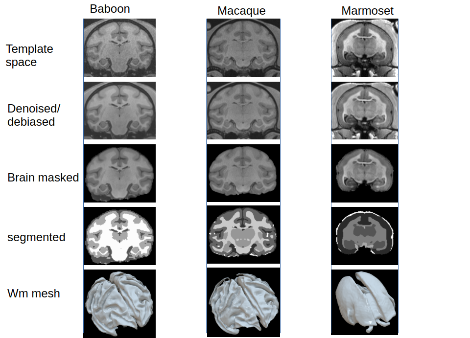

# Macapype: An Open Multi-Software Framework for Non-Human Primate Brain Anatomical MRI Processing

## Summary

Although brain anatomical Magnetic Resonance Imaging (MRI) processing is largely standardized and functional in humans, it remains a challenge to define robust processing pipelines for the segmentation of non-human primate (NHP) images. To unify the processing of NHP anatomical MRI, we propose Macapype, an open-source framework to create custom pipelines for data preparation, brain extraction, and brain segmentation.

## Statement of Need

Non-human primates (NHPs) are increasingly used for neuroimaging studies due to the progress of MR acquisitions and the promises it holds in the field of neuroscience [@milham2018open]. Structural MR images are essential for accessing anatomical information, defining regions of interest for functional and diffusion studies, providing cortical surface reconstruction, or localizing implanted electrodes for electrophysiology. Despite the standardization of MRI processing in humans with several well-known software options available, such as AFNI [@cox1996afni], FSL [@smith2004advances], SPM12 [@frackowiak1997human], and ANTS [@avants2011reproducible], defining robust processing pipelines for NHP anatomical image segmentation remains difficult. Standard human pipelines do not work directly on NHP images due to differences in head geometry, size, and anatomical content (e.g., large muscles). Moreover, acquisition parameters and experimental settings are much more variable in NHP studies than in human studies, making it challenging to define a single method to segment properly anatomical MR images of all NHP species. Therefore, there is a real need for efficient, versatile software that can handle the variability of encountered images.

## Related Packages

Several methods have been proposed to address the issue of NHP anatomical MR image segmentation. Some of these have been built as adaptations of existing methods originally developed for human images. For instance:

- **NHP-Freesurfer**: An adaptation of Freesurfer [@fischl2012freesurfer] that uses the NMT macaque atlas to segment macaque images and extract surfaces.
- **CIVET-Macaque**: An adaptation of the CIVET method [@lepage2021civet] to extract cortical surfaces from macaque MR images.
- **PREEMACS**: Uses various functions from FSL , ANTS , MRTrix [@tournier2019mrtrix3], MRIqc [@esteban2017mriqc], and Freesurfer [@fischl2012freesurfer] to extract cortical surfaces from MR images and register them to the same template.
- **Precon-all**: Uses a combination of ANTS, FSL, and Freesurfer to segment images and extract surfaces. A major drawback is the dependencies on five user-defined masks, including a brain mask, left and right hemisphere masks, a non-cortical mask (cerebellum and brain stem), and a subcortical (medial wall) mask.
- **U-Nets**: Used to perform brain extraction from macaque MR images [@ZHONG2021117649].
- **nBEST**: DeepLearning program used to provide brain mask, segmentation of GM, WM and subcurtical nuclei [@ZHONG2024120652]. *Requires the use of GPUs, and performs relatively badly on small PNH species such as marmoset*.

Unfortunately, none of these software solutions are versatile and flexible enough to fully perform segmentation while handling the variety of species and image characteristics encountered in NHP neuroimaging studies.

## Presentation of the Package

In this context, we propose a general framework for the tissue segmentation of non-human primate brain MR images that can provide multiple pipelines to adapt to a variety of image qualities and species. This open-source framework, named Macapype, is built on the Nipype framework [@gorgolewski2011nipype]. Nipype is a widely used Python framework for human MRI analysis, providing tools for building pipelines for diffusion, structural, and functional MRI. It provides "wraps" of different software, such as AFNI, FSL, SPM12, and ANTS, to build pipelines that mix functions requiring different scripting languages in a unified framework.

The Macapype package was specifically designed to provide:

1. Wraps of custom tools specific to NHP anatomical MRI preprocessing, such as AtlasBRex [@lohmeier2019atlasbrex] and NMT-based alignment [@seidlitz2018population].
2. Pipelines and workflows specific to different NHP species and MRI acquisition sequences to achieve high-quality automated tissue segmentation of NHP anatomical images. In particular, the tuning of parameters for different species, and even more specifically of different individuals of the same species, should be possible if needed via the use parameters files

## Pipelines

Macapype provides several pipelines that may be configured depending on processing needs, and are organized in 3 steps: data preparation, brain extraction, and brain segmentation pipelines. An extra postprocessing pipeline is also available for data formatting for external use (see Figure \ref{pipeline})

### Data Preparation Pipeline

The composition and order of the steps in the data preparation pipeline are specified in a json paramaters file and will also depend on the individual parameters provided. One of the most important manual steps is setting the cropping parameters for the image, requiring a manual inspection of all subject/session images. If the cropping parameters are absent, Macapype will result in an automated but low-precision crop. If cropping parameters are provided for T1w only and a T2w image is also available, the T2w image will be aligned to the T1w image, and the cropping parameters will be used for both images. If cropping parameters are provided for both T1w and T2w, the crop will be performed independently, and only then will the cropped T2w be aligned to the cropped T1w. It is even possible to crop independently each T1w and T2w separated acquisitions, although the standard is to average all the images of a given type.

Note that input volume needs to be reoriented in standard space (e.g., using fslreorient2std if NIFTI orientation is correctly labeled), so that AC-PC line of brain is parallel to Y-axis.

Finally, a step of denoising using non-local means methods can be optionally performed before a mandatory debiasing step using N4debias (ANTS).

### Brain Extraction Pipeline

For the skull-stripping step, Macapype provides a choice between AtlasBRex [@lohmeier2019atlasbrex] and bet4animal, an optimized version of BET (FSL) specifically for NHP. It is also possible to use hd-bet [@Isensee2019hdbet] relying on deep-learning brain extraction.

### Tissue Segmentation Pipeline

Tissue segmentation pipelines are only based on template-based segmentation in Macapype, but segmentation can be done either in template or native space. In both cases, normalization between scanner-based and T1 template is required, as priors are required to be projected in native space if segmentation in native space is used. We provide at least one template for the following NHP species: macaque (inia19 and NMT 1.3), marmoset (MBM v3.0.1), baboon (haiko89), and chimpanzee (JunaChimp).

We apply T1xT2 (T1wxT2w) debias on brain-only T1w and T2w images as a first step of brain segmentation. Then, normalization to template space can be done either using NMT provided tools (even if the NMT template is not used) or an in-house iterative registration tool. Finally, the tissue segmentation processing is performed with the ANTS-based Atropos method or the SPM-based old segment method.

### Post-Processing Pipeline

Two formatting options are provided:

1. Reorganizing the different tissues into one single file in the order expected by the 5tt file from MRTrix.
2. Generating meshes using IsoSurface (AFNI), in particular the white matter + gray matter (wm+gm), as well as each tissue mesh independently.

## Examples

We provide illustrations obtained by applying the standard pipelines to three different species (macaque, baboon, and marmoset).

## Discussion

Macapype is compatible with FAIR principles, with the creation and storage of a 'final' json parameter file containing all the arguments, version and the processing steps that were used for any given instance of processing. We also provide a MRI sample for 3 different species (macaque, marmoset and baboon), corresponding to the data used in Figure \ref{example}. We believe it is crucial for the community to share segmentations for benchmarking. It is of particular importance that Deep learning based segmentation (e.g. [@Wang2021unet]  [@ZHONG2024120652]) are evaluated on benchmark datasets and compared to ground truth.

Macapype provides a unified framework to perform image processing with the ability to evaluate the results obtained at different preprocessing steps compared to ground truth and to assess compatibility between the steps. This allows for choosing the most adapted steps for a given custom analysis, depending on the availability and quality of the data present in the dataset (e.g., if T1w or T1w and T2w images are available, the quality of the acquisition due to antenna constraints). For easier dissemination, Macapype has been tested on various images from the PRIME-DE database [@milham2018open] and is listed as a software solution on PRIME-RE [@messinger2021collaborative].

## Acknowledgements

We are grateful to Adrien Meguerditchian, Paul Apicella and Guilhem Ibos for using sample of their MRI datasets as exemples and tests on the different species.

## References
